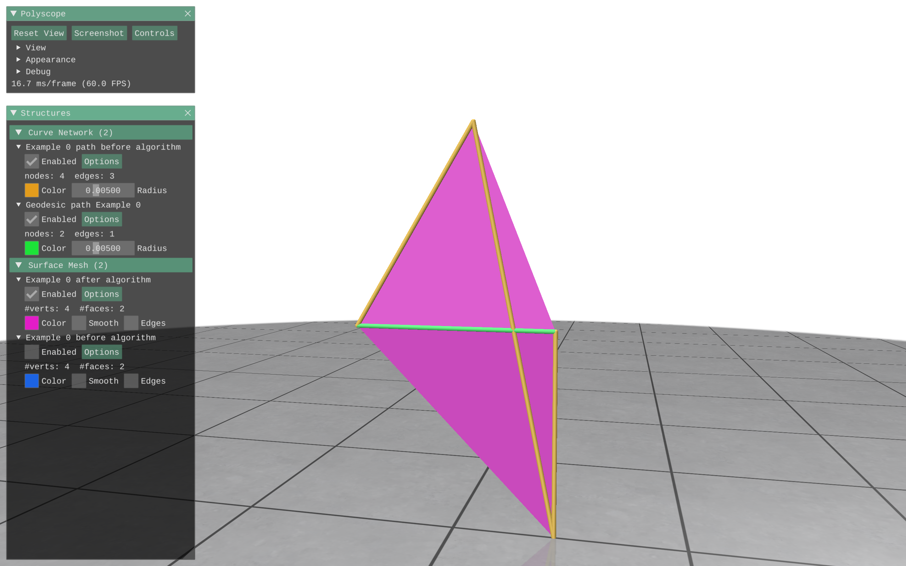
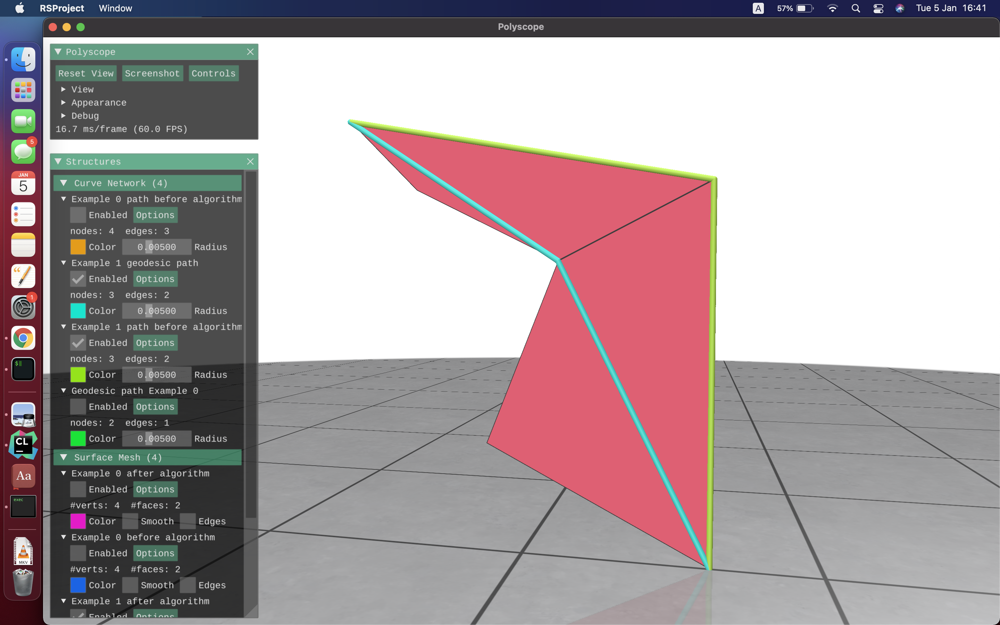

# Project 25-Računanje-geodezijskih-putanja

Projekat je zamišljen kao biblioteka koja podržava osnovne funkcionalnosti mnogostrukosti kao što su učitavanje i
vizualizacija. Takođe dozvoljovaja smanjenje dužine puta između dva čvora obrtanjem grana. Način rada algoritma možete 
naći [ovde](http://www.cs.cmu.edu/~kmcrane/Projects/FlipOut/FlipOut.pdf).

##Instalacija

- Potrebno je imati biblioteku [boost](https://www.boost.org/) (min. verzija 1.53.0) instaliranu na Vašem računaru.

##Zavisnosti

Za vizualizaciju projekat koristi sledeće biblioteke:

- [geometry-central](https://github.com/nmwsharp/geometry-central)
- [eigen](https://gitlab.com/libeigen/eigen/-/tree/master/Eigen)
- [polyscope](https://github.com/nmwsharp/polyscope)

## Strukture podataka

- Čvor
- Ivica
- Trougao
- Kompleks

##Primer rada algoritma

Slike su dobijene kao rezultati pokretanja testova Example0 i Example1

## Developers

- [Bogdan Nešić, 44/2012](https://gitlab.com/da5id2517)
